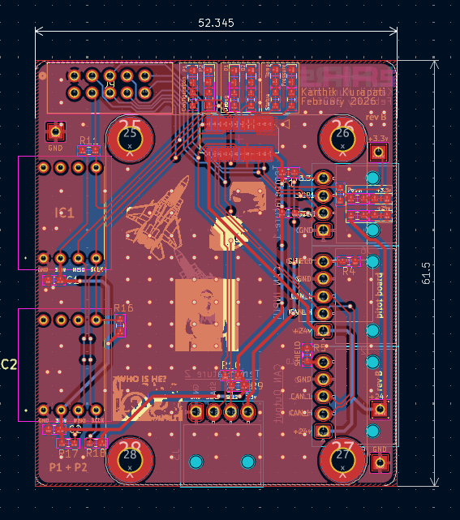
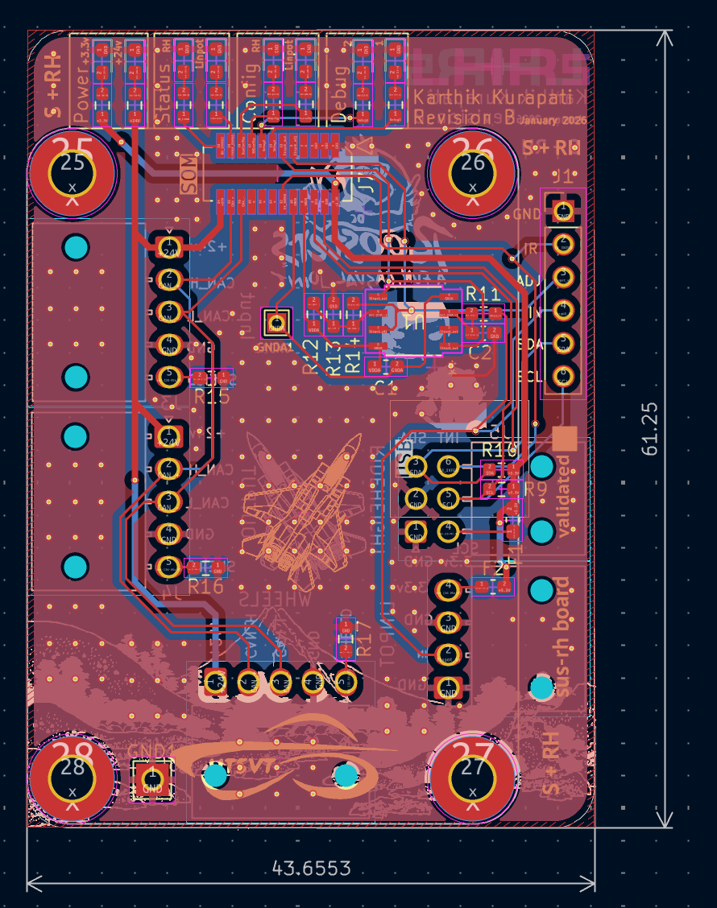
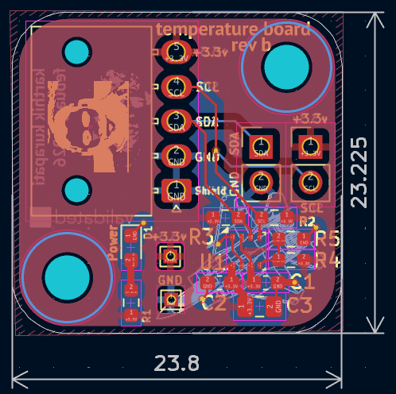
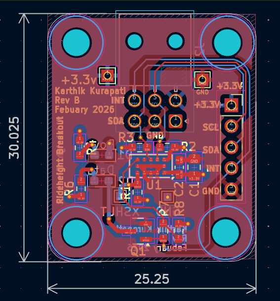

# Air-Suspension Boards

> **Project:** Longhorn Racing Solar - Hardware & Telemetry
> **Author:** Karthik Kurapati 

This repository contains the hardware design files for 4 sensors on the car: Suspension (Linear Potentiometers), Pitot, Temperature/Pressure, and RideHeight. 

## Table of Contents
1. [Telemetry CAN Overview](#CAN-overview)
2. [PSOM Boards](#psom-boards)
    - [Pitot Board](#1-pitot-board)
    - [Sus-RH (Suspension & Ride Height) Board](#2-sus-rh-board)
3. [Breakout Boards](#breakout-boards)
    - [Temperature Breakout](#3-temperature-breakout)
    - [Ride Height Breakout](#4-ride-height-breakout)

---

## Telemetry CAN Overview

P - Pitot Board
T - Temperature Breakout
L - Telemetry Leader
S - Sus-RH Board
RH - Sus-RH Board + Ride Height Breakout
W - Wheels Board

---

## PSOM Boards

These boards integrate a PSOM to collect data from sensors 

### 1. Pitot Board
**Function:** Measures the vehicle's true airspeed via a pitot sensor. Relays data sent by the temperature sensor to telemetry leader. 
**Sensors**: HSCDRRN010NDSA3

### 2. Sus-RH Board
**Function:** Measures linear potentiometer (suspension) travel on the car via ADC. Interfaces with ride height breakout. 
**Sensor:** LPPS-12

---

## Breakout Boards

Simple boards that use nano-fits to connect to the boards above to add functionality. Both breakouts use I2C to communicate over the distance. 

### 3. Temperature Breakout
**Function:** Provide valuable temperature, pressure, humidity, and air density information to improve estimate of airspeed. 
**Sensor:** BME280 

### 4. Ride Height Breakout (IR Board)
**Function:** Provides the distance from the bottom of the car to the road in multiple areas.
**Sensor** VL53L0X

---
